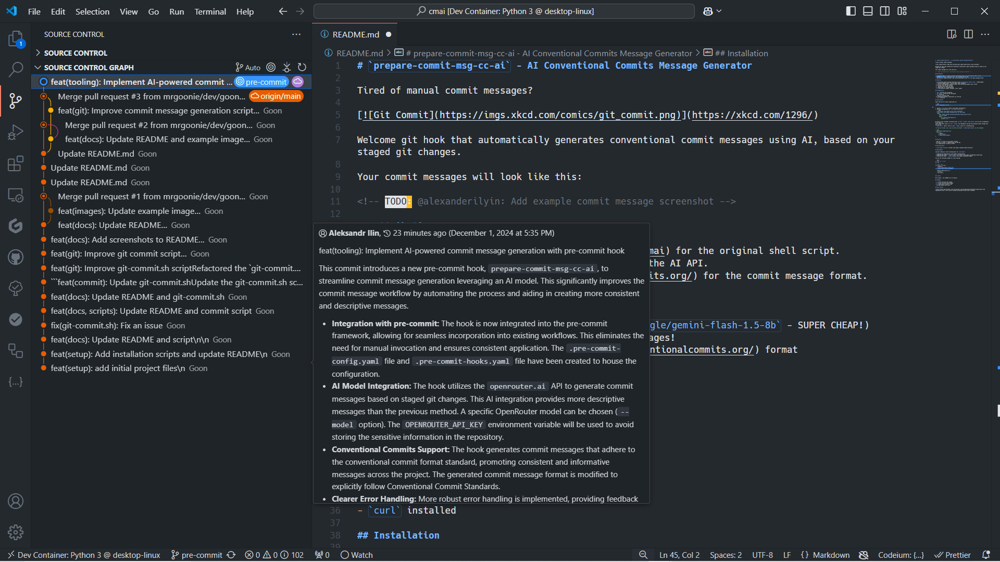
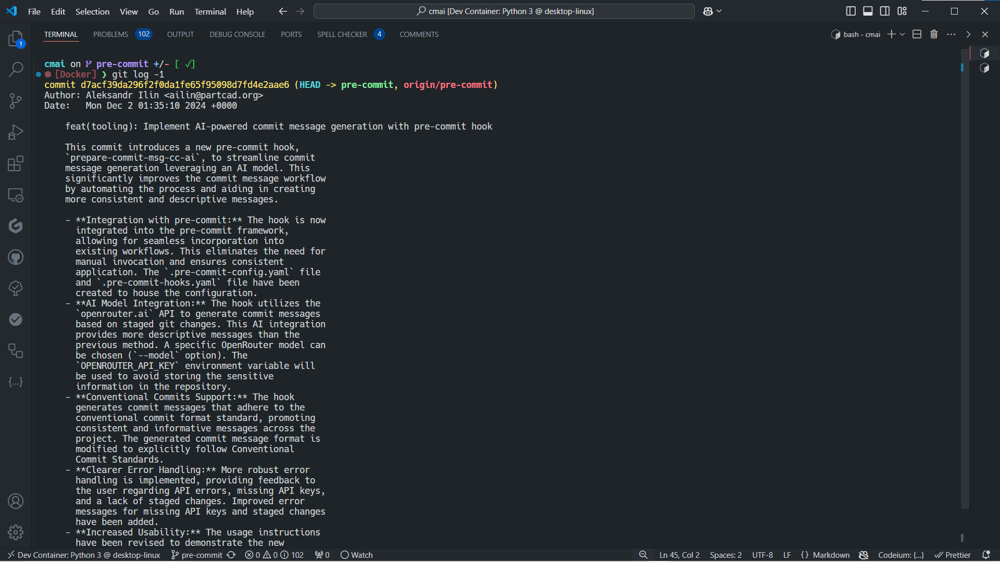
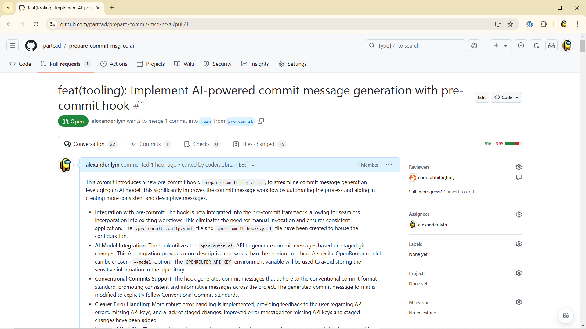
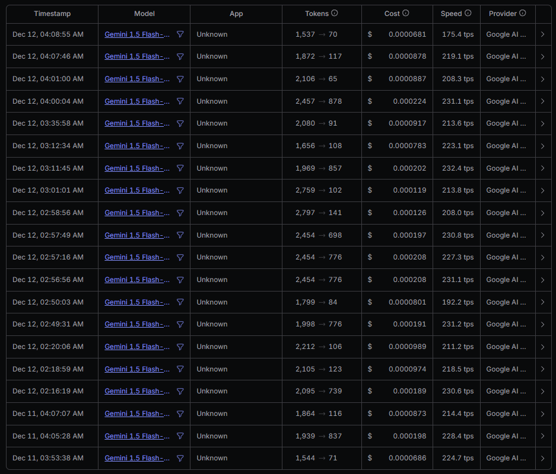

[](https://conventionalcommits.org)
[![Keep a Changelog v1.1.0 badge][changelog-badge]][changelog] [![Apache 2.0 License Badge][license-badge]][license]

# `pre-commit` - Git Hooks backed by AI

Fed up with crafting commit messages by hand?

[](https://xkcd.com/1296/)

## Attribution

- [`mrgoonie/cmai.git`](https://github.com/mrgoonie/cmai) for the original shell script.
- [OpenRouter](https://openrouter.ai/) for providing the AI API.
- [Conventional Commits](https://www.conventionalcommits.org/) for the commit message format.
- [Keep a Changelog](https://keepachangelog.com/en/1.1.0/) for the changelog format.

### Related Projects

- https://github.com/insulineru/ai-commit
- https://github.com/compilerla/conventional-pre-commit

## Prerequisites

- `git` installed and configured
- `pre-commit` installed and configured
- `jq` installed
  - Used for escaping JSON
- An [OpenRouter](https://openrouter.ai/) API key
- `curl` installed

## Configuration

Export API key for [OpenRouter](https://openrouter.ai/)

Option 1: Store in .env file (recommended):

```bash
echo "OPENROUTER_API_KEY=your_key_here" > .env
source .env
```

Option 2: Use credential storage (alternative)

```bash
export OPENROUTER_API_KEY="$(pass show openrouter/api_key)"
```

### `prepare-commit-msg`

Welcome to `prepare-commit-msg`, a git hook that automatically generates conventional commit messages using AI based on
your staged git changes. Your commit messages will look like this:

[](./images/vs-code-1.png)

[](./images/vs-code-2.png)

[](./images/gh-pr.png)

#### Features

- 🤖 AI-powered commit message generation (using `google/gemini-flash-1.5-8b` - SUPER CHEAP!)
  - Around $0.00001/commit -> $1 per 100K commit messages!
- 📝 Follows [Conventional Commits](https://www.conventionalcommits.org/) format
- 🐛 Debug mode for troubleshooting

#### Installation

1. Install [`pre-commit`](https://pre-commit.com/#install).
2. Add hook configuration to `.pre-commit-config.yaml`.
   ```yaml
   # See https://pre-commit.com for more information
   # See https://pre-commit.com/hooks.html for more hooks
   repos:
     - repo: https://github.com/partcad/pre-commit
       rev: v1.1.0
       hooks:
         - id: prepare-commit-msg
           verbose: true
   ```

By default, only filenames collected using `git diff --cached --name-status` will be sent to OpenRouter. If you want to
share commit diffs using `git diff --cached` with OpenRouter and get more detailed commit messages, you can use the
`--open-source` option.

> If you set custom `args` you will have to provide `--commit-msg-filename` as last argument.

```yaml
- id: prepare-commit-msg
  args: [
     "--debug",
     "--open-source",
     "--commit-msg-filename",
]
```

### `keep-a-changelog`

#### Features

- 🤖 AI-powered commit message generation (using `google/gemini-flash-1.5-8b` - SUPER CHEAP!)
  - Around $0.00001/commit -> $1 per 100K commit messages!
- 📝 Follows [Keep a Changelog](https://keepachangelog.com/) format
- 🐛 Debug mode for troubleshooting

#### Installation

1. Install [`pre-commit`](https://pre-commit.com/#install).
2. Add hook configuration to `.pre-commit-config.yaml`.
   ```yaml
   # See https://pre-commit.com for more information
   # See https://pre-commit.com/hooks.html for more hooks
   repos:
     - repo: https://github.com/partcad/pre-commit
       rev: v1.1.0
       hooks:
         - id: keep-a-changelog
           verbose: true
   ```

## API Security

- API key is stored in environment variable or secure credential storage
- No data is persisted except the API key in your secure storage
- All communication is done via HTTPS

## Data Privacy

- By default, only file names are sent to OpenRouter
- When using `--open-source`, complete diffs are sent
- Consider reviewing changes before staging to avoid leaking sensitive data

### Security and Privacy Considerations for `--open-source` Option

When you use the `--open-source` option, the complete diffs of your staged changes are sent to the OpenRouter API to
generate more detailed commit messages. This means that the actual content of your code changes — including additions,
deletions, and modifications — is transmitted over the network. While OpenRouter uses secure HTTPS connections to
protect data in transit, sharing full diffs can potentially expose sensitive code, proprietary algorithms, or
confidential information. It's important to ensure that your code does not contain any sensitive or private data before
using this option. By default, only filenames collected using `git diff --cached --name-status` are sent, minimizing the
amount of information shared.

## Rate Limiting & Costs

- API is rate limited to prevent abuse
- Costs approximately $0.00001 per commit
- Large diffs may incur higher costs



## Uninstallation

- [`pre-commit uninstall`](https://pre-commit.com/#pre-commit-uninstall)

## Development

Consider reading at least following docs for `pre-commit`:

- [Creating new hooks](https://pre-commit.com/#new-hooks)
- [Supported git hooks - `prepare-commit-msg`](https://pre-commit.com/#prepare-commit-msg)
- [Creating new hooks - `stages`](https://pre-commit.com/#hooks-stages)

You can use following snippet for local testing:

```bash
# Stage some changes
git add .

# Trigger hook
pre-commit try-repo \
   --verbose \
   --hook-stage=prepare-commit-msg \
   --commit-msg-filename=$(mktemp) \
   . \
   prepare-commit-msg \
   --verbose \
   --all-files \
```

...but it's easier just work in the fork directly and let `.pre-commit-hooks.yaml` do the magic for you.

## Licenses

- Original work in upstream [`mrgoonie/cmai.git`] licensed under [MIT]
- This fork is licensed under [Apache License 2.0]

## Join The Project Team

Join `#pre-commit` channel on
<a href="https://discord.gg/UMttCQb8xe"></a>

## Roadmap

- [ ] Integrate with 1Password.
- [ ] Allow truncate data which is sent to OpenRouter.
- [ ] Cross-platform support (Windows, Linux, macOS)
- [ ] Allow direct usage of LLMs.
  - Add Ollama integration.

### Keep a Changelog

- [ ] Move to JSON format.
- [ ] Use JSON schema for response validation.
- [ ] Send only current version number of the changelog.
  - [ ] Let LLM decide which version part should be updated (major, minor, patch).

### Conventional Commits

- [ ] Move to JSON format.
- [ ] Format message to wrap at 50 characters.

### Done

- [x] Create dedicated hook for updating `CHANGELOG.md`
- [x] Add GitHub stars chart.
- [x] Allow override user prompt.
- [x] Allow override system prompt.

## Star History

[](https://star-history.com/#partcad/pre-commit&Timeline)

[Apache License 2.0]: https://github.com/partcad/pre-commit/blob/main/.github/LICENSE
[`mrgoonie/cmai.git`]: https://github.com/mrgoonie/cmai
[MIT]: https://github.com/mrgoonie/cmai/tree/3398ab52778b999fa170a734411be6d69c4f1697?tab=readme-ov-file#license
[changelog]: ./CHANGELOG.md
[changelog-badge]: https://img.shields.io/badge/changelog-Keep%20a%20Changelog%20v1.1.0-%23E05735
[license]: ./.github/LICENSE
[version-badge]: https://img.shields.io/badge/version-1.8.1-blue.svg
[license-badge]: https://img.shields.io/badge/license-Apache%20License%202.0-blue.svg
