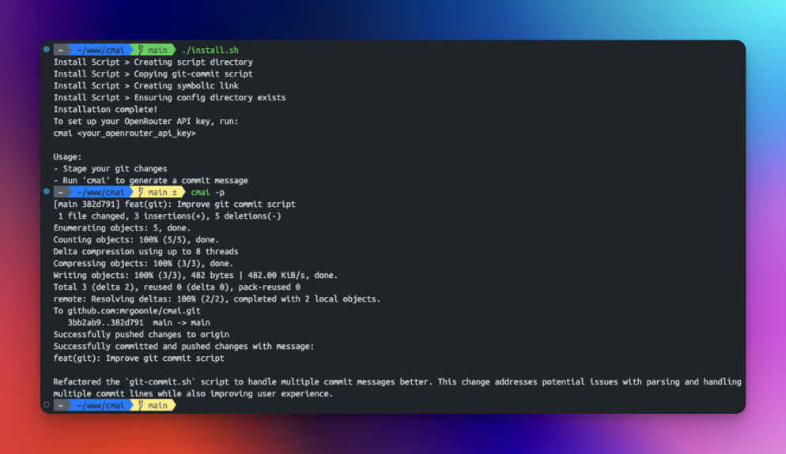

# `cmai` - AI Commit Message Generator

A command-line tool that automatically generates conventional commit messages using AI, based on your staged git changes.

Your commit messages will look like this:


## Features

- 🤖 AI-powered commit message generation (using `google/gemini-flash-1.5-8b` - SUPER CHEAP!)
  - Around $0.00001/commit -> $1 per 100K commit messages!
- 📝 Follows [Conventional Commits](https://www.conventionalcommits.org/) format
- 🔒 Secure local API key storage
- 🚀 Automatic git commit and push
- 🐛 Debug mode for troubleshooting
- 💻 Cross-platform support (Windows, Linux, macOS)

## Prerequisites

- Git installed and configured
- For Windows: Git Bash or WSL installed
- For Linux/macOS: Bash shell environment
- An [OpenRouter](https://openrouter.ai/) API key
- `curl` installed

## Installation

### Linux/macOS

1. Clone this repository: 

```bash
git clone https://github.com/mrgoonie/cmai.git
cd cmai
```

2. Run the installation script:

```bash
./install.sh
```

This will:
- Create necessary directories
- Install the script globally as `cmai`
- Set up proper permissions

### Windows

1. Clone this repository:

```bash
git clone https://github.com/mrgoonie/cmai.git
cd cmai
```

2. Run the installation script in Git Bash:

```bash
./install.sh
```

Or manually:
- Copy `git-commit.sh` to `%USERPROFILE%\git-commit-ai\`
- Add the directory to your PATH environment variable
- Rename `git-commit.sh` to `cmai.sh`

This will:
- Create necessary directories
- Install the script globally as `cmai`
- Set up proper permissions

## Configuration

Set up your OpenRouter API key:

```bash
cmai <your_openrouter_api_key>
```

The API key will be securely stored in:
- Linux/macOS: `~/.config/git-commit-ai/config`
- Windows: `%USERPROFILE%\.config\git-commit-ai\config`

## Usage



1. Make your code changes
2. Generate commit message and commit changes:

```bash
cmai
```

To also push changes to remote:
```bash
cmai --push
# or
cmai -p
```

To use a different AI model:
```bash
cmai --model qwen/qwen-2.5-coder-32b-instruct
```

List of available models: https://openrouter.ai/models

This will:
- Stage all changes
- Generate a commit message using AI
- Commit the changes
- Push to the remote repository (if --push flag is used)

### Debug Mode

To see detailed information about what's happening:

```bash
cmai --debug
```

You can combine flags:
```bash
cmai --debug --push
```

## Examples

```bash
# First time setup with API key
cmai your_openrouter_api_key

# Normal usage
cmai

# Commit and push
cmai --push

# Debug mode
cmai --debug

# Debug mode with push
cmai --debug --push

# Use a different AI model
cmai --model qwen/qwen-2.5-coder-32b-instruct

# Combine multiple flags
cmai --debug --push --model qwen/qwen-2.5-coder-32b-instruct
```

Example generated commit messages:
- `feat(api): add user authentication system`
- `fix(data): resolve memory leak in data processing`
- `docs(api): update API documentation`
- `style(ui): improve responsive layout for mobile devices`

## Directory Structure

### Linux/macOS

```
~
├── git-commit-ai/
│ └── git-commit.sh
├── .config/
│ └── git-commit-ai/
│ └── config
└── usr/
└── local/
└── bin/
└── cmai -> ~/git-commit-ai/git-commit.sh
```

### Windows

```
%USERPROFILE%
├── git-commit-ai/
│ └── cmai.sh
└── .config/
└── git-commit-ai/
└── config
```

## Security

- API key is stored locally with restricted permissions (600)
- Configuration directory is protected (700)
- No data is stored or logged except the API key
- All communication is done via HTTPS

## Troubleshooting

1. **No API key found**
   - Run `cmai your_openrouter_api_key` to configure

2. **Permission denied**
   - Check file permissions: `ls -la ~/.config/git-commit-ai`
   - Should show: `drwx------` for directory and `-rw-------` for config file

3. **Debug mode**
   - Run with `--debug` flag to see detailed logs
   - Check API responses and git operations

4. **Windows-specific issues**
   - Make sure Git Bash is installed
   - Check if curl is available in Git Bash
   - Verify PATH environment variable includes the installation directory

## Uninstallation

### Linux/macOS

```bash
bash
sudo rm /usr/local/bin/cmai
rm -rf ~/git-commit-ai
rm -rf ~/.config/git-commit-ai
```

### Windows

```bash
rm -rf "$USERPROFILE/git-commit-ai"
rm -rf "$USERPROFILE/.config/git-commit-ai"
```
Then remove the directory from your PATH environment variable

## Contributing

1. Fork the repository
2. Create your feature branch
3. Commit your changes (using `cmai` 😉)
4. Push to the branch
5. Create a Pull Request

## License

MIT License - see LICENSE file for details

## Acknowledgments

- [OpenRouter](https://openrouter.ai/) for providing the AI API
- [Conventional Commits](https://www.conventionalcommits.org/) for the commit message format

## My other products

- [DigiCord AI](https://digicord.site) - The Most Useful AI Chatbot on Discord
- [IndieBacklink.com](https://indiebacklink.com) - Indie Makers Unite: Feature, Support, Succeed
- [TopRanking.ai](https://topranking.ai) - AI Directory, listing AI products
- [ZII.ONE](https://zii.one) - Personalized Link Shortener
- [VidCap.xyz](https://vidcap.xyz) - Extract Youtube caption, download videos, capture screenshot, summarize,…
- [ReadTube.me](https://readtube.me) - Write blog articles based on Youtube videos
- [BoostTogether.com](https://boosttogether.com) - The Power of WE in Advertising
- [AIVN.Site](https://aivn.site) - Face Swap, Remove BG, Photo Editor,…
- [DxUp.dev](https://dxup.dev) - Developer-focused platform for app deployment & centralized cloud resource management.
